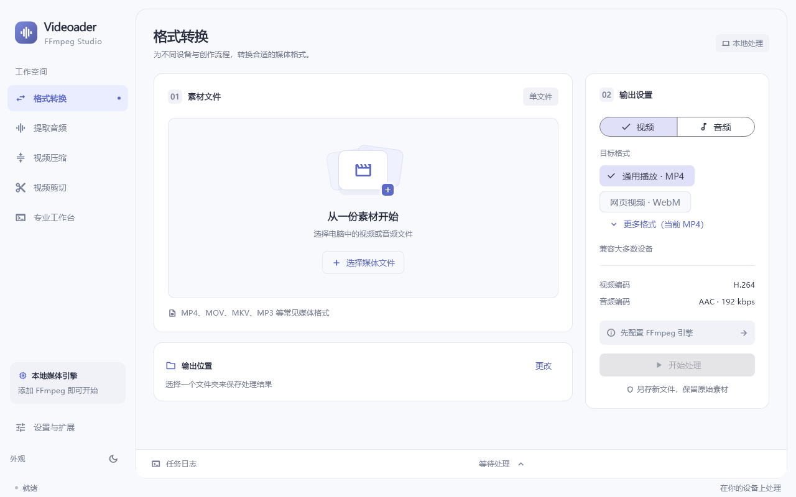
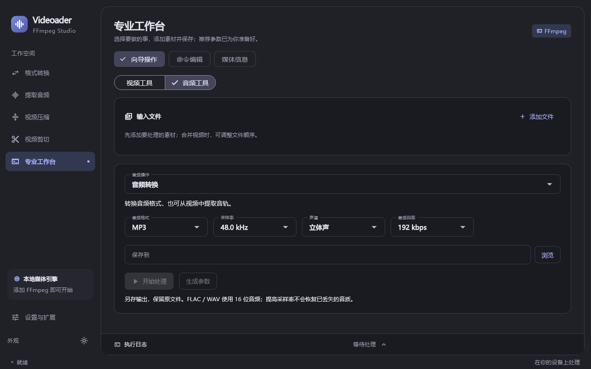

# Videoader · FFmpeg Studio

一个基于 Flutter 的桌面音视频工具箱。核心负责本地 FFmpeg 处理，网络下载通过可选的 yt-dlp 内置扩展提供。当前主要开发与验证平台为 Windows；Linux、macOS 保留桌面工程，尚未完成发行验证。Android 工程为历史脚手架，本地进程工具不支持 Android。



## 功能

- **格式转换**：视频支持 MP4、MKV、MOV、WebM、AVI、FLV、TS；音频支持 MP3、M4A、FLAC、WAV。按视频/音频分类，更多视频格式按需展开。
- **提取、压缩与剪切**：从视频提取音轨，使用 CRF 压缩视频，按时间截取片段。输出另存新文件。
- **专业工作台**：向导操作与命令编辑并存。视频支持转码、换封装、缩放、旋转、倍速、字幕、GIF 和拼接；音频支持转换、剪切、拼接、响度统一、采样率与声道设置。
- **专业参数**：编码器、码率、CRF、硬件解码、视频/音频滤镜、命令导入导出，以及媒体信息与本机编码能力检测。
- **设置与关于**：分组设置、FFmpeg 检测、默认输出目录、扩展开关、版本信息与应用更新检查。



## 开始使用

1. 在“设置与扩展 → FFmpeg 引擎”选择已解压的 `ffmpeg` 可执行文件，点击检测版本；媒体信息功能还需要同目录的 `ffprobe`。
2. 设置默认保存位置，添加素材，选择工具和输出格式，再开始处理。
3. 需要下载网络媒体时，在设置中启用 **yt-dlp 网络下载**，配置 yt-dlp 路径。Aria2 为可选下载器。

FFmpeg 可从 [官方下载页面](https://ffmpeg.org/download.html) 选择对应系统构建，yt-dlp 可从 [官方发布页](https://github.com/yt-dlp/yt-dlp/releases) 获取。FFmpeg 当前采用下载、解压、选择路径的方式配置，应用不自动安装它；已配置的 yt-dlp 可在扩展设置中更新。

## 下载扩展与 Cookie

网络下载支持按行输入多个链接、画质上限（至 4K）、音频/封面下载，以及字幕、播放列表范围、限速、重试、代理、命名模板和自定义参数。高级参数需点击“应用参数”后生效。

在“下载与 Cookie → Cookie 管理”选择浏览器、填写可选的配置文件，再点击“应用 Cookie 来源”。先在相应浏览器登录网站，应用会在下载时通过 yt-dlp 读取登录状态。浏览器模式优先于手动 Cookie 文件，不会将浏览器 Cookie 导出到原来的站点文件。Windows 上 Chrome/Edge 的加密或数据库占用可能导致读取失败，可尝试 Firefox 或手动导入 Netscape cookies.txt。也支持粘贴 Cookie 请求头。

登录信息与下载参数保存在本机，请勿将 Cookie 文件提交到仓库或分享。网站访问限制、账号权限和网络风控仍可能使下载失败，配置 Cookie 不保证消除 HTTP 412 等错误。

扩展目前是**随应用编译的模块**，不是可下载安装的第三方插件市场。接口见 [扩展开发说明](docs/extensions.md)。

## 处理规则与限制

- WebM 使用 VP9 + Opus，AVI 使用 MPEG-4 + MP3；其余基础视频预设使用 H.264 + AAC。更多编码器可在专业工作台选择。
- 基础 MP3/M4A 提供 128–320 kbps；FLAC/WAV 使用 16 位输出。转换无损格式或提高采样率不会恢复源文件已丢失的信息。
- 音频拼接会统一采样率和声道再编码；响度统一使用 `loudnorm` 单遍动态处理，目标 -16 LUFS。视频拼接需要相同分辨率且各段含音轨。
- 压缩后的体积取决于源素材，不保证一定更小；硬件编码是否可用取决于 FFmpeg 构建、显卡与驱动。
- 自定义命令以参数数组调用本地程序，不经系统 Shell。修改命令时请自行确认输入、输出及覆盖选项。

## 开发与构建

需要支持当前依赖的 Flutter stable、Dart 3，以及目标平台的桌面编译工具链。Windows 需要 Visual Studio 的 C++ 桌面开发工具。仓库保留 `pubspec.lock` 以固定依赖版本。

```sh
flutter pub get
flutter analyze lib test
flutter test
flutter build windows --release
```

Windows 也可以运行 `./build.ps1`，或 `./build.ps1 -Clean`。构建输出位于 `build/windows/x64/runner/Release/`；分发时应打包整个 Release 目录，不要只复制 exe。构建产物放到 GitHub Releases，不提交到源码仓库。

真实媒体测试需要外部 FFmpeg（同目录应有 ffprobe）：

```powershell
$env:FFMPEG_TEST_PATH = 'D:\tools\ffmpeg\bin\ffmpeg.exe'
flutter test --reporter expanded --timeout 120s
```

不设置该变量时会跳过实际转码测试，其余参数、配置和界面测试仍运行。CI 使用 Linux FFmpeg 运行媒体回归。Windows 下可设置 `CAPTURE_TOOLBOX=1` 并使用 `flutter test test/widget_test.dart --update-goldens` 更新文档截图。

## 应用更新

“设置与扩展 → 关于 Videoader”检查 [本仓库 Releases](https://github.com/Cydiacoft/videoder_demo/releases) 的最新公开正式发布，展示更新说明并提供下载入口。当前不自动下载、替换或安装程序。

版本信息读取打包的 `pubspec.yaml`。发布时请同步版本号，使用 `v主版本.次版本.修订版本` 标签并上传完整发行包。没有可访问的公开发布、网络失败、限流或无法识别的版本号时，检查不会误报为“已是最新版”。

## 许可证

本项目采用 **GNU General Public License v3.0（GPL-3.0-only）**，完整条款见 [LICENSE](LICENSE)，历史代码的版权声明保留在 [NOTICE](NOTICE)。

FFmpeg、yt-dlp、Aria2、Flutter 及第三方依赖各自遵循其许可证。外部工具默认不随本项目分发；若制作包含这些工具的发行包，须同时遵守相应许可证及分发要求。
